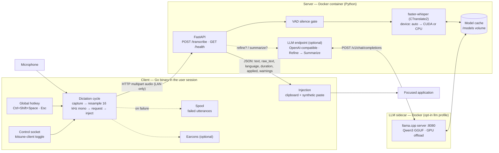
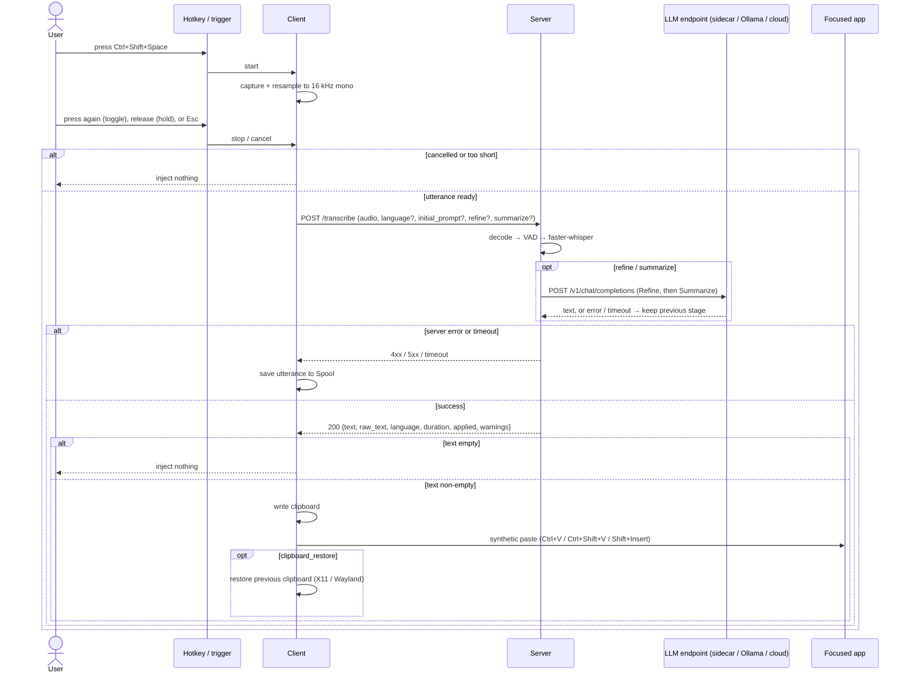

# kitsune-whisper

Private, LAN-local speech-to-text dictation for Windows and Linux. Press a global
hotkey, speak, press it again, and the transcription appears at your cursor —
audio never leaves your network.

- A Go **Client** runs in your logged-in user session, captures the microphone,
  resamples to 16 kHz mono, and injects the transcription via clipboard +
  synthetic paste.
- A Python **Server** transcribes with faster-whisper, auto-detects CUDA vs CPU,
  and exposes `POST /transcribe` and `GET /health`. It ships as a Docker image.
- An optional **LLM sidecar** (the official llama.cpp server, behind the opt-in
  `llm` compose profile) runs on your GPU for local Refine/Summarize. The Server
  talks to it — or to any OpenAI-compatible endpoint (Ollama, LM Studio, a cloud
  API) — over HTTP.
- All read one `kitsune.yaml` (each process reads only its own section).

## Architecture

The **Client** and **Server** talk HTTP over your LAN; the optional **LLM
sidecar** is a third container the Server calls the same way. Only the Client
touches the desktop (hotkeys, microphone, clipboard); the Server and sidecar
touch the models. Audio never leaves the network.

- **Client** (Go, user session) — binds the global hotkey, captures the
  microphone, resamples to 16 kHz mono, POSTs the utterance, then injects the
  returned text at the cursor. On failure it saves the audio to the Spool instead
  of losing it.
- **Server** (Python + faster-whisper) — behind `POST /transcribe` it decodes the
  request, runs the VAD silence gate, transcribes on the auto-resolved device,
  and returns JSON. It can optionally post-process the text through an
  OpenAI-compatible LLM endpoint (see **Processing** below). `GET /health`
  reports the resolved device, compute type, model, and whether processing is
  enabled.
- **Processing** (optional) — a request may ask the Server to **Refine** (remove
  disfluencies, add punctuation) and/or **Summarize** (compress to the key
  points). Refine runs before Summarize. It is off by default and never makes
  transcription fail: a disabled, unreachable, timed-out, or empty step is
  skipped, the text falls back to the previous stage, and the response says why
  in `warnings`. The Server talks to any **OpenAI-compatible** chat-completions
  endpoint: the bundled llama.cpp sidecar (opt-in `llm` compose profile), an
  existing Ollama / LM Studio service, or a cloud API. It is configured under
  `server.processing` in `kitsune.yaml`; the Client asks for it with
  `client.refine` / `client.summarize`
  (see [Configuration](docs/configuration.md)). The built-in `base_url` is
  loopback, so processing stays local; the bundled `llm` profile points it at
  the sidecar instead, and an **external `base_url` sends the transcribed text
  off the host** (the audio still stays on your network).
- **Transport** — plain HTTP/1.1, one utterance per request (batch, no streaming
  in v1). `kitsune.yaml` is shared; each process reads only its own section.

### Components



### A Dictation cycle



## Quickstart (NVIDIA GPU)

The fast path on an NVIDIA host: Docker runs the **Server** (CUDA) plus a bundled
llama.cpp **sidecar** for local Refine/Summarize, and the Go **Client** runs on
your desktop. Nothing is compiled and nothing leaves the machine.

Prerequisite: a recent NVIDIA driver and **`nvidia-container-toolkit`** (Linux) or
Docker Desktop with WSL2 GPU passthrough (Windows) — see
[GPU prerequisites](#gpu-prerequisites). CPU-only and external-endpoint setups
are in [`docs/install.md`](docs/install.md).

### 1. Server + local LLM (Docker)

```sh
cp kitsune.example.yaml kitsune.yaml
```

Turn the feature on in `kitsune.yaml` — the Server master switch and the Client's
per-utterance flags (`server.processing.enabled` is `false` by default):

```yaml
server:
  processing:
    enabled: true      # was false
client:
  refine: true         # was false
  summarize: true      # was false
```

Then start the Server and the matching sidecar (targeting both starts exactly
those two and auto-enables their profiles):

```sh
docker compose up -d server-gpu llama-gpu
```

The Server reads `/config/kitsune.yaml` (bind-mounted from the file above), so
restart it after later edits (`docker compose restart server-gpu`). The Client
reads the `client:` section from its own config (see [step 2](#2-client)); you can
point it at this same file instead with `--config ./kitsune.yaml` or
`KITSUNE_CONFIG=$PWD/kitsune.yaml`.

The first run downloads the Whisper `small` model and the Qwen3 GGUF into the
shared `kitsune-models` volume; later runs reuse them. The Server listens on
`http://localhost:8000`, and the sidecar is reachable on the compose network as
`llama` — which the Server services are already pointed at.

Confirm the GPU and processing are live (give the sidecar a moment to warm up;
the Server degrades gracefully until it answers):

```sh
curl http://localhost:8000/health
```

`device` should be `cuda`, `compute_type` `float16`, and `processing.enabled`
`true`. To smoke-test the pipeline without the Client:

```sh
curl -F audio=@sample.wav -F refine=true http://localhost:8000/transcribe
```

### 2. Client

```sh
# Linux
curl -fsSL https://raw.githubusercontent.com/FoxRed-cmd/kitsune-whisper/main/install.sh | bash
```

```powershell
# Windows (PowerShell 7+)
irm https://raw.githubusercontent.com/FoxRed-cmd/kitsune-whisper/main/install.ps1 | iex
```

The installer verifies the archive checksum, installs the binary, drops a
`kitsune.yaml` template (only if absent), and registers autostart in the user
session. Point it at the Server and enable the flags above in the Client's config
(path in [`docs/install.md`](docs/install.md#where-things-go)):

```yaml
client:
  server_url: http://localhost:8000
  refine: true
  summarize: true
```

Restart the Client service after editing (`systemctl --user restart
kitsune-client.service` on Linux; `Stop-ScheduledTask`/`Start-ScheduledTask
-TaskName kitsune-client` on Windows). Re-run the installer to upgrade;
`--uninstall` / `-Uninstall` removes it. See [`docs/install.md`](docs/install.md).

### 3. Dictate

With the Client running, press **Ctrl+Shift+Space** to start recording, speak,
and press it again to stop. The transcription is pasted into the focused field.
Press **Esc** to cancel without injecting. The hotkey, the cancel key, and the
trigger mode are all configurable; `client.trigger: hold` switches to
push-to-talk.

If the Server isn't reachable the Client reports it and saves the audio to the
Spool instead of losing your speech. An empty transcription injects nothing. If
the LLM sidecar is slow or down, Refine/Summarize is skipped and you still get
the raw transcription.

## The hotkey

- **Toggle** (default): press to start, press again to stop.
- **Hold**: hold to talk, release to stop — set `client.trigger: hold`.
- **Cancel**: `client.cancel_hotkey` (default `Esc`) aborts the utterance.

The defaults are `client.hotkey: Ctrl+Shift+Space` and
`client.cancel_hotkey: Esc`. On Wayland, hotkeys are best-effort; see
[Wayland support and known limitations](docs/wayland.md).

## Server (Docker)

The Server ships as a Docker image with two profiles:

| Profile | Base image | When to use |
| --- | --- | --- |
| `cpu` | `python:3.11-slim` | Any host; slower, no GPU needed |
| `gpu` | `nvidia/cuda:12.3.2-cudnn9-runtime-ubuntu22.04` | NVIDIA GPU; near-instant |

An opt-in `llm` profile starts a bundled llama.cpp sidecar
(`ghcr.io/ggml-org/llama.cpp:server` / `:server-cuda`) for local
Refine/Summarize; start it with the matching Server
(`docker compose up -d server-gpu llama-gpu`, or `server-cpu llama-cpu` on a
CPU-only host). See
[Optional post-processing](docs/install.md#optional-post-processing).

### GPU prerequisites

The `gpu` profile needs the host to expose an NVIDIA GPU to Docker:

- **Driver**: a recent NVIDIA driver on the host (`nvidia-smi` must work). The
  container ships the CUDA 12.3 / cuDNN 9 runtime; only the driver comes from the
  host.
- **Linux**: install [nvidia-container-toolkit](https://docs.nvidia.com/datacenter/cloud-native/container-toolkit/latest/install-guide.html)
  and configure the Docker runtime, then restart Docker. Verify with
  `docker run --rm --gpus all nvidia/cuda:12.3.2-cudnn9-runtime-ubuntu22.04 nvidia-smi`.
- **Windows (WSL2)**: use Docker Desktop with the WSL2 backend and a distro with
  GPU passthrough; confirm `nvidia-smi` works inside WSL before starting.
- The image bundles `nvidia-cublas-cu12`, because the CTranslate2 wheel ships cuDNN
  but not cuBLAS. `/health` reports the resolved `device`/`compute_type`, so you can
  confirm the GPU is actually in use.

### Recommended hardware

An **NVIDIA/CUDA GPU is recommended** for near-instant transcription; CPU-only
hosts are supported but slower. See
[`docs/install.md#recommended-hardware`](docs/install.md#recommended-hardware) for
the CPU escape hatch (`base`/`tiny`), the low-VRAM `int8_float16` note, and the
measured latency figures.

### Images

Images are published to GHCR by `.github/workflows/publish-server-image.yml`:

- `ghcr.io/foxred-cmd/kitsune-whisper-server:cpu`
- `ghcr.io/foxred-cmd/kitsune-whisper-server:gpu`

Tagged releases (`v*`) publish as `vX.Y.Z-cpu` / `vX.Y.Z-gpu`; pushes to `main`
publish `cpu` / `gpu`. To build locally instead:

```sh
docker compose --profile cpu build
docker compose --profile gpu build
```

## Documentation

- [`docs/install.md`](docs/install.md) — install, paths, autostart, upgrade/uninstall, hardware.
- [`docs/configuration.md`](docs/configuration.md) — the full `kitsune.yaml` reference.
- [`docs/wayland.md`](docs/wayland.md) — Wayland support matrix and known limitations.
- [`docs/adr/`](docs/adr/) — architecture decisions; [`GLOSSARY.md`](GLOSSARY.md) — domain terms.

## Development

- **Python (server)** — from `server/`: `uv run pytest`, `uv run ruff check .`,
  `uv run ruff format --check .`, `uv run basedpyright`.
- **Go (client)** — from `client/`: `go build ./...`, `go test ./...` (set
  `CGO_ENABLED=1` with a C compiler; `malgo` uses cgo).

### End-to-end verification

`scripts/e2e-live.ps1` (Windows) and `scripts/e2e-live.sh` (Linux) bring up a real
Server and run the live slice — speech round trip, latency, silence, and error
paths — through [`scripts/e2e_live.py`](scripts/e2e_live.py). See
`docs/verification/e2e-live-slice.md` for the automated checks and the manual
hotkey/capture/injection checklist.

### Releases

Tagging `v*` runs `.github/workflows/release-client.yml`: it builds the Client on
native Linux and Windows runners and attaches checksummed archives to the GitHub
Release. `publish-server-image.yml` publishes the Server images to GHCR.

## License

Released under the [MIT License](LICENSE).
